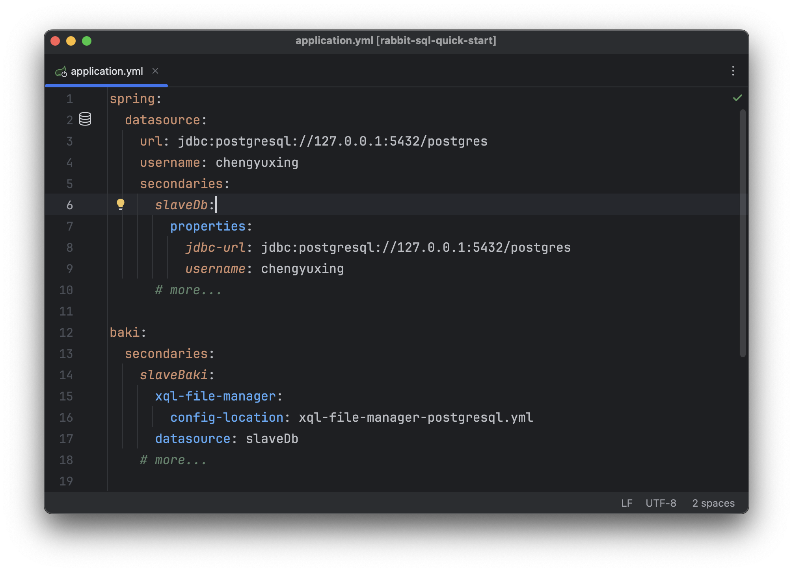
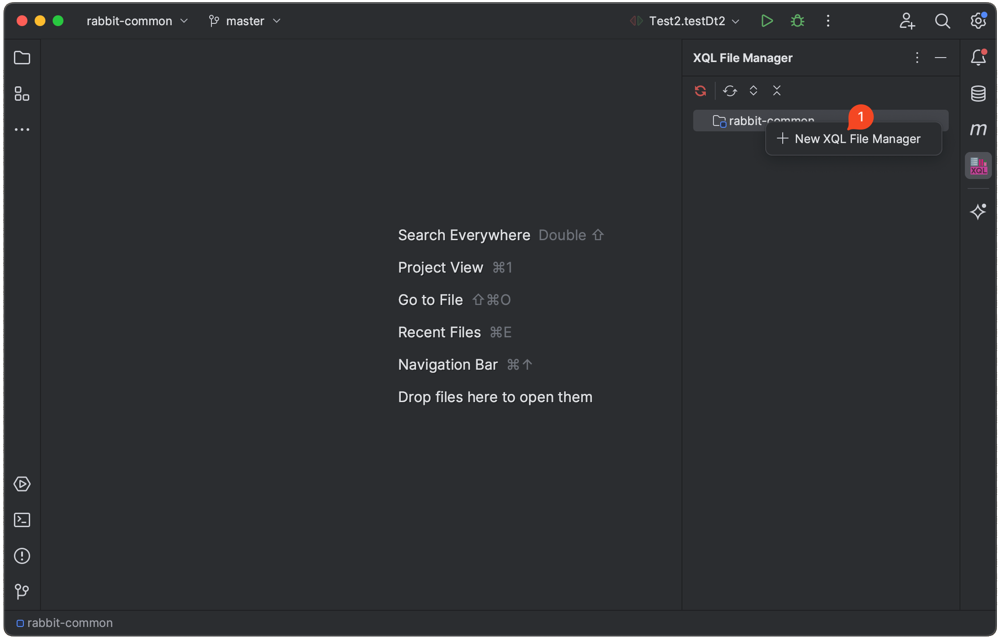

# rabbit-sql-spring-boot-starter

[![License][badge:license]][license]
[![Maven][badge:maven]][maven-repository]
[![Version][badge:version]][versions]


语言: [English](https://github.com/chengyuxing/rabbit-sql-spring-boot-starter) | 简体中文

## 介绍

查看[最佳实践](https://github.com/chengyuxing/rabbit-sql/blob/master/BEST_PRACTICE.chs.md)来快速开始。

基于 **rabbit-sql** 制作的**spring-boot**自动装配**starter**，默认使用spring的事务管理，方法头上可通过注解 `@Transactional` 生效或者手动注入 `com.github.chengyuxing.sql.spring.autoconfigure.Tx` （对spring事务的简易封装）来使用事务。

- 兼容spring jdbc事务；
- 兼容mybatis、spring-data-jpa等同时进行事务处理；

:warning: 请勿使用**rabbit-sql**内置的`Tx`事务，事务已完全由spring全局事务替代。

- ~~com.github.chengyuxing.sql.transaction.Tx~~ ❌
- com.github.chengyuxing.sql.spring.autoconfigure.Tx ✅

关于rabbit-sql的使用方法可以具体看[文档](https://github.com/chengyuxing/rabbit-sql)。

## maven dependency

_java 17+_

```xml
<dependency>
    <groupId>com.github.chengyuxing</groupId>
    <artifactId>rabbit-sql-spring-boot-starter</artifactId>
    <version>4.0.15</version>
</dependency>
```

_java 8_

```xml
<dependency>
    <groupId>com.github.chengyuxing</groupId>
    <artifactId>rabbit-sql-spring-boot-starter</artifactId>
    <version>3.2.9</version>
</dependency>
```

## IDEA 插件支持

动态sql测试：


xql接口代码生成：


插件商店搜索 [Rabbit sql](https://plugins.jetbrains.com/plugin/21403-rabbit-sql)，帮助文档：[Rabbit sql plugin](https://github.com/chengyuxing/rabbit-sql-plugin/blob/main/README.chs.md)。

## 配置说明

`application.yml` 必要配置：

```yaml
spring:
  datasource:
    url: jdbc:postgresql://127.0.0.1:5432/postgres
    username: chengyuxing
```

即可使用**依赖注入**`Baki`进行一些操作：

```java
@Autowired
Baki baki;
```

### 自定义配置

通过IntelliJ IDEA编辑`application.yml`输入**baki**可提示所有配置项，一个简单的例子如下：

`application.yml`

```yaml
baki:
  xql-file-manager:
    files:
      a: mydir/one.sql
      b: mydir/two.sql
```

### 多数据源配置



```java
@Autowired
@Qualifier("slaveBaki")
Baki slaveBaki;
```

### 配合[插件](https://plugins.jetbrains.com/plugin/21403-rabbit-sql)工作



1. 移除 `application.yml` 中的属性 `xql-file-manager`；
2. 将原有的 sql 文件后缀改为 `.xql`；
3. 在资源根目录 `.../src/main/resources` 下建立文件 `xql-file-manager.yml`；
4. 配置[属性](https://github.com/chengyuxing/rabbit-sql/blob/master/README.chs.md#构造函数)。

### 简单使用

支持两种方式，可根据需求自由选择：

- 注入核心接口`Baki`；
- Springboot启动类添加注解 `@XQLMapperScan` ，编写 **xql** [映射接口](https://github.com/chengyuxing/rabbit-sql/blob/master/README.chs.md#接口映射)，注入接口，例如 `ExampleMapper.java`；

```java
@SpringBootApplication
@XQLMapperScan
public class Startup implements CommandLineRunner {
    public static void main(String[] args) {
        SpringApplication.run(Startup.class, args);
    }

    @Autowired
    Baki baki;
  
    @Autowired
    ExampleMapper exampleMapper;

    @Override
    public void run(String... args) throws Exception {
        try (Stream<DataRow> s = baki.query("&a.region").arg("id", 5).stream()) {
            s.forEach(System.out::println);
        }
    }
}
```

**spring注解管理的事务**：

```java

@Service
public class MyService {

    @Autowired
    Baki baki;
  	
    // com.github.chengyuxing.sql.spring.autoconfigure.Tx
  	@Autowired
  	Tx tx;

    @Transactional
    public void a() {
        ...
    }
  
  	public void b(){
      tx.using(()->{
        ...
      });
    }
}
```

[badge:maven]:https://img.shields.io/maven-central/v/com.github.chengyuxing/rabbit-sql-spring-boot-starter
[badge:license]: https://img.shields.io/github/license/chengyuxing/rabbit-sql-spring-boot-starter
[badge:version]:https://img.shields.io/jetbrains/plugin/v/21403

[license]:https://github.com/chengyuxing/rabbit-sql-spring-boot-starter/blob/main/LICENSE
[maven-repository]:https://central.sonatype.com/artifact/com.github.chengyuxing/rabbit-sql-spring-boot-starter
[versions]:https://plugins.jetbrains.com/plugin/21403-rabbit-sql/versions