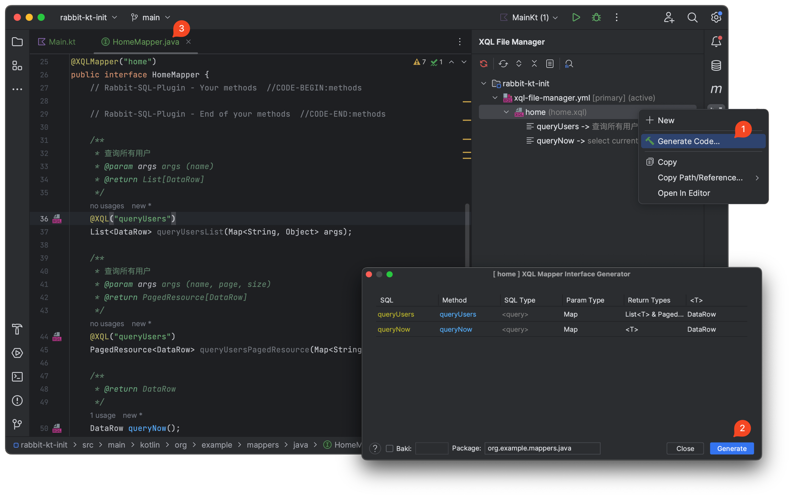
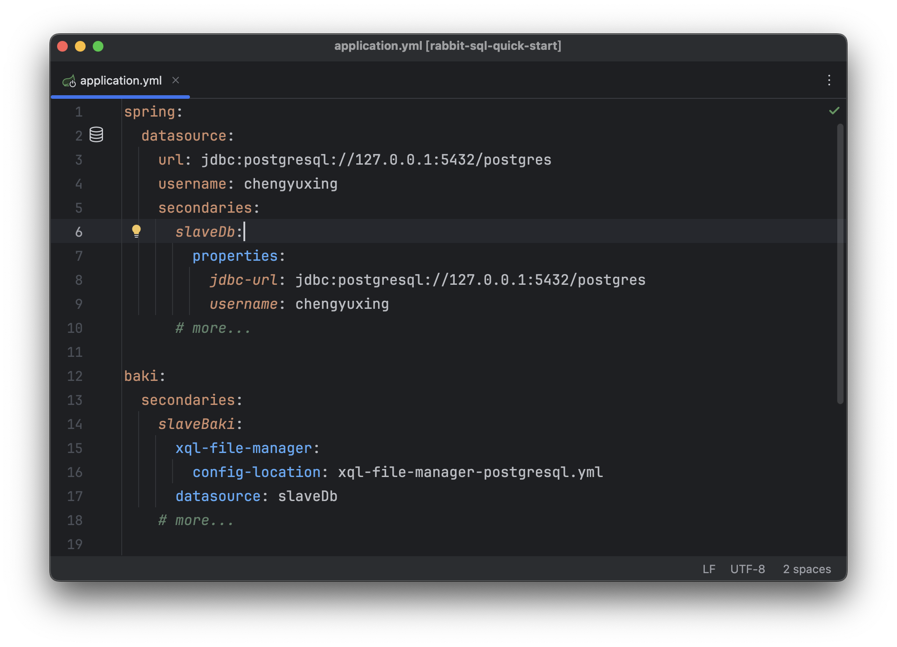
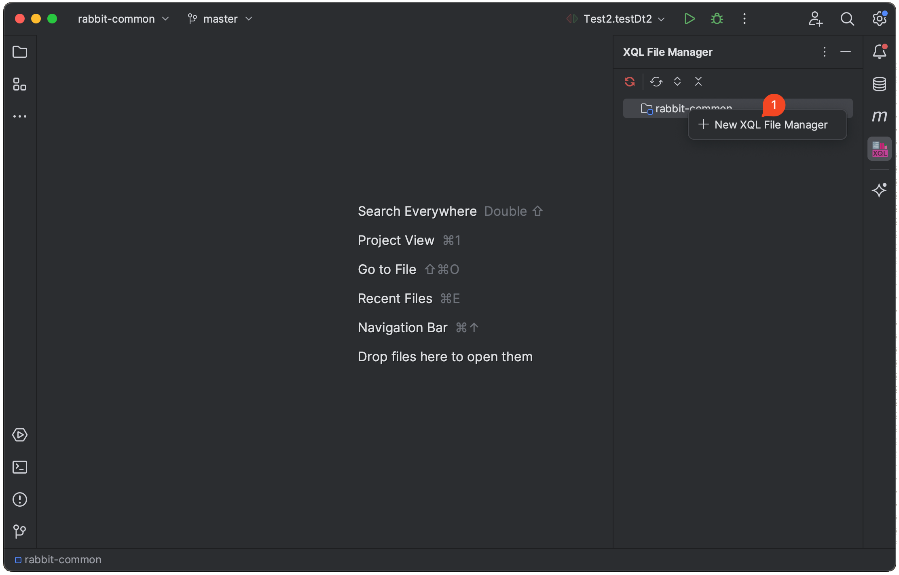

# rabbit-sql-spring-boot-starter

[![License][badge:license]][license]
[![Maven][badge:maven]][maven-repository]
[![Version][badge:version]][versions]

<a href="https://rabbitsql.cn" target="_blank"></a>

Language: English | [简体中文](https://github.com/chengyuxing/rabbit-sql-spring-boot-starter/blob/main/README.chs.md)

## Introducing

Get [Best practice](https://github.com/chengyuxing/rabbit-sql/blob/master/BEST_PRACTICE.md) to quick start.

Spring-boot autoconfigure starter based on **rabbit-sql**, use spring managed transaction as default, use `@Transactional` annotation or inject `com.github.chengyuxing.sql.spring.autoconfigure.Tx` (simple wrapper for spring transaction) to use transaction.

- compatible with spring jdbc transaction;
- compatible with mybatis, spring-data-jpa and so on to use transaction together;

:warning: don't use **rabbit-sql's** built-in `Tx`, use spring transaction instead.

- ~~com.github.chengyuxing.sql.transaction.Tx~~ ❌
- com.github.chengyuxing.sql.spring.autoconfigure.Tx ✅

get more usage about **rabbit-sql** from [document](https://github.com/chengyuxing/rabbit-sql)。

## Maven dependency

_java 8_

```xml
<dependency>
    <groupId>com.github.chengyuxing</groupId>
    <artifactId>rabbit-sql-spring-boot-starter</artifactId>
    <version>5.0.0</version>
</dependency>
```

## IDEA plugin support

Dynamic sql test:


Xql interface mapper generate:



Plugin marketplace: [Rabbit sql](https://plugins.jetbrains.com/plugin/21403-rabbit-sql) and [documentation](https://github.com/chengyuxing/rabbit-sql-plugin#readme).

## Configuration

`application.yml` (`spring.datasource` is required):

```yaml
spring:
  datasource:
    url: jdbc:postgresql://127.0.0.1:5432/postgres
    username: chengyuxing
```

Inject `Baki` ready to use:

```java
@Autowired
Baki baki;
```

### Custom configuration

begin with input **baki** to edit `application.yml`, a simple example look like:

`application.yml`

```yaml
baki:
  xql-file-manager:
    files:
      a: mydir/one.sql
      b: mydir/two.sql
```

### Multiple datasource configuration



```java
@Autowired
@Qualifier("slaveBaki")
Baki slaveBaki;
```

### Working with [Rabbit sql plugin](https://plugins.jetbrains.com/plugin/21403-rabbit-sql) 



1. Remove the `xql-file-manager` property from `application.yml` ;
2. Sql file extension must rename to `xql` ;
3. Create `xql-file-manager.yml` in resource root `.../src/main/resources` ;
4. Configure [properties](https://github.com/chengyuxing/rabbit-sql#constructor).

### simple usage

Here is two way to use:

- Inject core interface `Baki` ;
- Springboot application startup class annotated with `@XQLMapperScan`,  create [interface mappring](https://github.com/chengyuxing/rabbit-sql#interface-mapping) to xql file, inject interface e.g `ExampleMapper.java`

```java
@SpringBootApplication
@XQLMapperScan
public class Startup implements CommandLineRunner {
    public static void main(String[] args) {
        SpringApplication.run(Startup.class, args);
    }

    @Autowired
    Baki baki;

    @Autowired
    ExampleMapper exampleMapper;
  
    @Override
    public void run(String... args) throws Exception {
        try (Stream<DataRow> s = baki.query("&a.region").arg("id", 5).stream()) {
            s.forEach(System.out::println);
        }
    }
}
```

**work with spring transaction**:

```java

@Service
public class MyService {

    @Autowired
    Baki baki;

    // com.github.chengyuxing.sql.spring.autoconfigure.Tx
    @Autowired
    Tx tx;
  
    @Transactional
    public void some() {
        ...
    }
  
    public void b(){
      tx.using(()->{
        ...
      });
    }
}
```

[badge:maven]:https://img.shields.io/maven-central/v/com.github.chengyuxing/rabbit-sql-spring-boot-starter
[badge:license]: https://img.shields.io/github/license/chengyuxing/rabbit-sql-spring-boot-starter
[badge:version]:https://img.shields.io/jetbrains/plugin/v/21403

[license]:https://github.com/chengyuxing/rabbit-sql-spring-boot-starter/blob/main/LICENSE
[maven-repository]:https://central.sonatype.com/artifact/com.github.chengyuxing/rabbit-sql-spring-boot-starter
[versions]:https://plugins.jetbrains.com/plugin/21403-rabbit-sql/versions